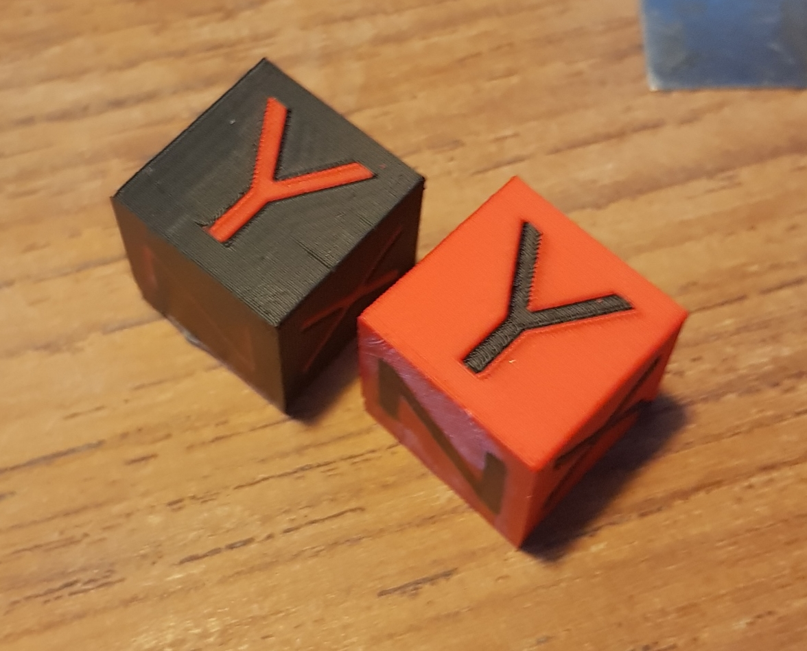

# miniab_idex
An idex playground built out of frankensteinium (voron miniab + anet scraps + steel frame anyone?)

## Machine description
A cartesian idex machine built from scraps and leftovers, with a usable build volume of about 200x200x240.
* Linear rails on all axis.
* Klipper 
* Rpi 3b
* Fluidd
* Fysetc S6 with 6xTMC2209 in UART mode (X1, X2, E1, E2, Z (both motors are in series), Y)
* 2xMini-afterburner
* Dual Z endstops. Z1 is used for homing reference, Z2 is used for carriage tilt measuring.
 

## Findings
Superslicer still has some work in fully supporting idex. For example wipe tower - tool change retract/unretract does not work as intended  
workaround; filament start & end gcode. 

Workaround *thanks* to https://github.com/prusa3d/PrusaSlicer/issues/5377

    ;  -------------------------------------->>>
    ; Custom G-code: Filament ABS - Start - START
    ; T[current_extruder] ; Current extruder
    {if wipe_tower}
    ; Wipe Tower used. Do extra de-retract.
    G92 E0 ; Zero extruders
    G1 E6 F2400
    ; G1 E{4 + retract_restart_extra_toolchange[current_extruder]} F{60 * deretract_speed[current_extruder]} ; De-retract for toolchange, 4mm.
    {endif}
    ; Custom G-code: Filament ABS - Start - END
    ; <<<--------------------------------------

    ; -------------------------------------->>>
    ; Custom G-code: Filament ABS - End - START
    ; T[current_extruder] ; Current extruder
    {if wipe_tower}
    ; Wipe Tower used. Do extra retract.
    G92 E0 ; Zero extruders
    G1 E-6 F2400
    ; G1 E-4 F{60 * retract_speed[current_extruder]} ; Retract for toolchange, 4mm.
    {endif}
    ; Custom G-code: Filament ABS - End - END
    ; <<<--------------------------------------

## Issues
Oozing from unused hotend. I want to add blockers, maybe thin flexible brass? 
No mirroring/duplication support (waiting for klipper).

## Future plans
Give Z2 a dedicated driver, so I can auto-tilt. Works very well.
But I'm out if drivers, so maybe add CAN toolheads somewhere?
Add probe mount, v6 nozzle perhaps so no offset? Do not need for homing, just for building mesh.
