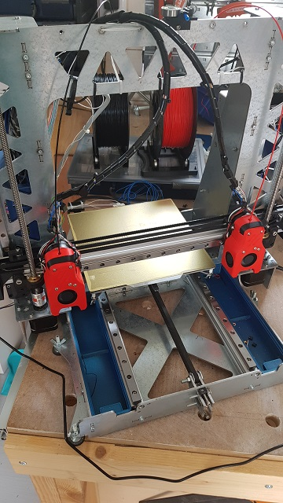

# miniab_idex
An idex playground built out of frankensteinium (voron miniab + anet + steel frame anyone?)

## Machine description
A cartesian idex machine built from scraps and leftovers, with a usable build volume of about 200x200x240.
* Linear rails on all axis.
* Klipper 
* Rpi 3b
* Fluidd
* Fysetc S6 with 6xTMC2209 in UART mode (X1, X2, E1, E2, Z, Y)
* 2xMini-afterburner
* Dual Z endstops. Z1 is used for homing reference, Z2 is used for carriage tilt measuring.
 

